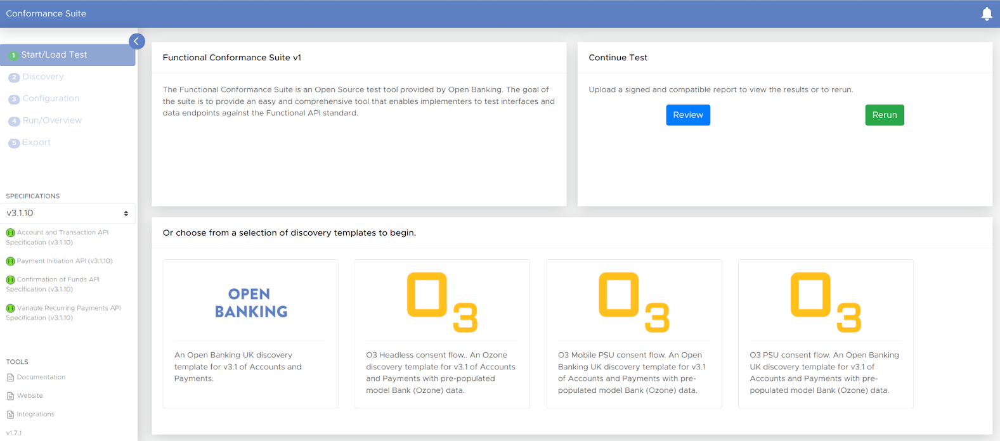

[//]: # (!!!info)

[//]: # (    WSO2 Open Banking 3.0.0 UK Toolkit 1.0.0 supports Functional Conformance Suite  v1.9.1.)

The  Open Banking Implementation Entity (OBIE) [Functional Conformance](https://openbanking.atlassian.net/wiki/spaces/DZ/pages/1061716467/Functional+Conformance) 
Certificate allows WSO2 Open Banking to demonstrate that the solution has successfully implemented all required functional 
elements of the OBIE Read/Write API specifications, passing all tests performed by the Functional Conformance Tool.

!!! tip "Before you begin:"
    Set up and prepare your servers to run WSO2 Open Banking UK Toolkit. Follow the [Set up Toolkits](../get-started/set-up-toolkits.md) documentation to set up the accelerators and toolkits.

## Generate Locally Signed SSL Certificate

1. Install [mkcert](https://github.com/FiloSottile/mkcert/releases). mkcert is a simple tool for making locally-trusted development certificates.

    !!!note
        For more information on downloading and installing mkcert, refer to the [mkcert installation guide](https://github.com/FiloSottile/mkcert#installation).
    
2. Create and install a local Certificate Authority (CA) on your computer using the following command:

    ```
    mkcert -install
    ```

3. View the root CA certificate location using the following command:

    ```
    mkcert -CAROOT   
    ```

4. Add mkcert root CA (self-signed root certificate) to both Identity Server and API Manager client truststores using the following command:

    ```
    keytool -import -alias rootCA -file <MKCERT_CA_ROOT_CERT> -keystore client-truststore.jks -storepass <CLIENT_TRUSTSTORE_PASSWORD>
    ```

5. Generate server certificates using the mkcert tool as follows:

    ```
    mkcert <trusted_domains> <server_hostname> <server_ip> ::1
    ```
   
    Given below is a sample configuration:
    ```
    mkcert localhost 127.0.0.1 ::1
    ```

6. Copy the root CA certificate to the `/usr/local/share/ca-certificates/` directory and `/etc/ssl/certs` directory and update the CA certificates.

    ```
    sudo update-ca-certificates
    ```

7. Create a new keystore with the generated certificate. 

    !!!note
        Use the same keystore password (`KEYSTORE_PASSWORD`) that you used to configure the existing keystore.

    a. Convert the PEM file into PKCS12 format. The password should be same as the default `wso2carbon.jks`.

       ```
       openssl pkcs12 -export -in <server_cert>.pem -inkey <server_key>.pem -out certificate.p12 -name "wso2carbon"
       ```

    b. Generate `wso2carbon.jks` from the PKCS12 file. The password should be same as the default `wso2carbon.jks`.

       ```
       keytool -importkeystore -srckeystore certificate.p12 -srcstoretype pkcs12 -destkeystore wso2carbon.jks
       ```

8. Back up the default keystore (`wso2carbon.jks`) residing in the security folder of both WSO2 Identity Server and WSO2 
   API Manager and replace it with the newly created `wso2carbon.jks` file.

9. Import the generated server certificate (in Step 5) to the client truststore of both `<WSO2_OB_IAM_HOST>` and `<WSO2_OB_APIM_HOST>` servers. 
   The client truststores for the WSO2 Open Banking API Manager and Identity Server are located in the following locations:

     - `<WSO2_IS_HOME>/repository/resources/security/client-truststore.jks`
     - `<WSO2_APIM_HOME>/repository/resources/security/client-truststore.jks`.

    Use the following command to add the certificates to the client truststores:

     ```
     keytool -import -alias mkcert_server_cert -file <SERVER_CERT>.pem -keystore client-truststore.jks -storepass wso2carbon
     ```

    !!!warning
         Don’t import the keystore (`wso2carbon.jks`) to the truststore. Instead, directly import the server certificate to the truststore.
    
    !!!note
         Exchange and trust the API Manager and Identity Server certificates, if the API Manager server and Identity Server are in different nodes.

10. Add the OBIE Root and Issuing Certificates to the `client-truststore.jks`. The client truststores for the WSO2 Open 
    Banking API Manager and Identity Server  are located in the following locations:

    - `<WSO2_IS_HOME>/repository/resources/security/client-truststore.jks`
    - `<WSO2_AM_HOME>/repository/resources/security/client-truststore.jks`

    Use the following commands to add the certificates to the client truststores:

    1. Add Root Certificate:
    
        ```
        keytool -import -alias <alias> -file <OB_ROOT_CERT> -keystore client-truststore.jks -storepass wso2carbon
        ```
    
    2. Add Issuing Certificate:
    
        ```
        keytool -import -alias <alias> -file <OB_ISSUING_CERT> -keystore client-truststore.jks -storepass wso2carbon
        ```

## Configure the Well-known Endpoint and Keystore for JWS Validation

Use one of the following options to configure the well-known endpoint:

- [Option 1: Update the well-known endpoint and JWKS endpoint](#option-1-update-the-well-known-endpoint-and-jwks-endpoint)
- [Option 2: Configure the default well-known endpoint](#option-2-configure-the-default-well-known-endpoint)
- [Option 3: Create a gist](#option-3-create-a-gist)

!!!note
    If you are running the functional conformance suite with JWS validations enabled, (with the `DISABLE_JWS=FALSE` tag), 
    [option 1](#option-1-update-the-well-known-endpoint-and-jwks-endpoint) is recommended.

### Option 1: Update the well-known endpoint and JWKS endpoint

Update the well-known endpoint and JWKS endpoint as instructed below according to your setup.

??? tip "Click here to see how it is done:..."

    1. Download and extract the [`well-known-config-resources.zip`](../assets/attachments/well-known-config-resources.zip).

    2. Go to the `well-known-config-resources` directory.

    3. Copy the `auth.server.info-1.0-SNAPSHOT.jar` file to the `<IS_HOME>/repository/components/lib` directory.

    4. Download the sample `openid-configuration.json` available [here](../assets/attachments/openid-configuration.json).

    5. Update the values in `openid-configuration.json` according to your setup. 
    
        a. Replace the  `<IS_HOSTNAME>` placeholder with the Identity Server hostname.

        b. Update the `jwks_uri` value to `https://<IS_HOSTNAME>:9446/oauth2/token/keystore`.
    
    6. Copy the `openid-configuration.json` file  into the `<IS_HOME>/repository/conf/identity` directory.

    7. Update the `keystore.json` file with the authorization server keys and client application keys generated for applications.

        !!!note
            If you are manually updating the entries in the `keystore.json` file for testing purposes only, follow the guide available 
            [here](https://support.phenixid.se/sbs/jwks/) to add the entry for your server keys to the `keystore.json` file. The keystore.json file should
            conatin keys of the client application and the keys in the jwks endpoints of Identity Server (https://<IS_HOSTNAME>:9446/oauth2/jwks). 

    8. Copy the `keystore.json` file into the `<IS_HOME>/repository/conf/identity` directory.

    9. Open the `<IS_HOME>repository/resources/conf/templates/repository/conf/tomcat/web.xml.j2` file and register the following servlets. Add the following elements before the `</webapp>` tag.

        ```xml
        <servlet>
               <servlet-name>Discovery</servlet-name>
               <servlet-class>auth.server.info.Discovery</servlet-class>
           </servlet>
        
           <servlet-mapping>
               <servlet-name>Discovery</servlet-name>
               <url-pattern>/token/.well-known/openid-configuration</url-pattern>
           </servlet-mapping>
        
           <servlet>
               <servlet-name>Keystore</servlet-name>
               <servlet-class>auth.server.info.Keystore</servlet-class>
           </servlet>
        
           <servlet-mapping>
               <servlet-name>Keystore</servlet-name>
               <url-pattern>/token/keystore</url-pattern>
           </servlet-mapping>
        ```

    10. Restart the Identity Server.

    11. Restart the API Manager server.

    12. Go to the following links and see the changes:

        - [https://<IS_HOST>:9446/oauth2/token/.well-known/openid-configuration](https://<IS_HOST>:9446/token/.well-known/openid-configuration)
        - [https://<IS_HOST>:9446/oauth2/token/keystore](https://<IS_HOST>:9446/oauth2/token/keystore)

### Option 2: Configure the default well-known endpoint

If you are running the functional conformance test suite without enabling JWS validations, you can configure the default 
well-known endpoint available at <https://localhost:9446/oauth2/token/.well-known/openid-configuration>.

### Option 3: Create a gist

For testing purposes, you can host the well-known configuration file via [Github Gist](https://gist.github.com).

??? tip "Click here to see how to create a gist:..."

    a. Sign in to GitHub.

    b. Navigate to the [GitHub Gist Homepage](https://gist.github.com).

    c. Create a gist.

    !!!note
        Provide the following details when creating the gist.

          - **Gist Description:** openid-configuration
          - **File Name:** openid-configuration
          - **Content:** configurations exposed via well-known endpoints. A sample `openid-configuration.json` is available [here](../assets/attachments/openid-configuration.json).

    d. Click **Create Public Gist**.

    e. Go to **Raw** and copy the URL. This URL can be used as `wellknown_endpoint` in the test suite and Key Manager.

## Configure the Solution

1. Open the `<WSO2_IS_HOME>/repository/conf/deployment.toml` file.

2. Locate the `[open_banking_uk.consent.payment_restrictions]` tag.

3. Set the `MaximumFuturePaymentDays` value to 365 as shown below:

    ```toml
    [open_banking_uk.consent.payment_restrictions]
    max_future_days = "365"
    ```

4. Locate the `[open_banking_uk.consent]` tag.

5. Enable account id validation on account retrieval as follows:

    ```toml
    [open_banking_uk.consent]
    validate_acc_id_on_retrieval_enabled = true
    ```

6. Open the `<WSO2_APIM_HOME>/repository/conf/deployment.toml` file.

7. Repeat steps 4 and 5.

8. Disable the certificate bound access token as follows:

    ```toml
    [apim.oauth_config]
    enable_certificate_bound_access_token = false
    ```

## Configure JWS Validation

**Enable JWS Validations in Open Banking Solution**

!!!note

    The following information is already available under steps 12 and 13 in the [Configuring API Manager](../install-and-setup/configuring-api-manager-for-ob.md) documentation. 
    Refer to the above-mentioned documentation for any updates on configuring JWS validations.

**To validate API requests:**

1. Open the `<APIM_HOME>/repository/conf/deployment.toml` file.

2. Configure the `UKJwsRequestHandlingExecutor` executor. The priority of `UKJwsRequestHandlingExecutor` must be higher 
   than `ConsentEnforcementExecutor`. For example:

    ```toml
    [[open_banking.gateway.openbanking_gateway_executors.type.executors]]
    name = "com.wso2.openbanking.uk.gateway.executors.jws.UKJwsRequestHandlingExecutor"
    priority = 4
    
    [[open_banking.gateway.openbanking_gateway_executors.type.executors]]
    name = "com.wso2.openbanking.accelerator.gateway.executor.impl.consent.ConsentEnforcementExecutor"
    priority = 5
    ```

3. Enable validation and define the valid signing algorithms for the JWS sent in the request header:

    ```toml
    [open_banking.jws_signature.signature_validation]
    enabled=true
    
    [[open_banking.jws_signature.signature_validation.allowed_algorithms]]
    algorithm="PS256"
    
    [[open_banking.jws_signature.signature_validation.allowed_algorithms]]
    algorithm="ES256"
    ```

4. The signing keys used for validation by an application are cached. The default expiration time for cache modification 
   and access is 60 minutes. To change these values, add and configure the following:

    ```toml
    [open_banking.common.identity.cache]
    cache_modified_expiry_minuites=30
    cache_access_expiry_minuites=30
    ```

5. The default trust anchor used for the validation is `openbanking.org.uk`. To change this value, add and configure the following:

    ```toml
    [open_banking.uk.jws_signature.obie]
    org_id="0015800001HQQrZAAX"
    
    [open_banking.uk.jws_signature.obie.trusted_anchors]
    signature_validation="openbanking.org.uk"
    ```

6. By default, signature validation is enabled for the Payments API. Configure the API contexts of other APIs that require signature validation. For example:

    ```toml
    [[open_banking.uk.jws_signature.signature_validation.mandated_apis]]
    api_context="/open-banking/v3.1/event"
    ```

**To let the TPPs verify that the request wasn't tampered with, sign the responses:**

1. Open the `<APIM_HOME>/repository/conf/deployment.toml` file.

2. Remove the below `UKJwsResponseHandlingExecutor` executor if it is available.

    ```toml
    [[open_banking.gateway.openbanking_gateway_executors.type.executors]]
    name = "com.wso2.openbanking.uk.gateway.executors.jws.UKJwsResponseHandlingExecutor"
    priority = 999
    ```

3. Enable signing and define the response signing algorithms. 

    ```toml
    [open_banking.jws_signature.response_signing]
    enabled=true
    allowed_algorithm="PS256"
    ```

4. Configure the alias and kid values of the signing certificates:

    - `signing_cert_alias`: The alias of the signing certificate stored in the keystore. Used to sign responses in a production environment. Default value is `wso2carbon`.
    - `sandbox_signing_cert_alias`: The alias of the signing certificate stored in the keystore. Used to sign responses in a sandbox environment. Default value is `wso2carbon`.
    - `signing_cert_kid`: The kid value of the corresponding public key of the private key, which is used for signing in a production environment. Default value is `1234`. The value should be the kid value of the signing key in jwks endpoints of Identity Server `(https://<IS_HOSTNAME>:9446/oauth2/jwks)`. This is a mandatory configuration.
    - `sandbox_signing_cert_kid`: The kid value of the corresponding public key of the private key, which is used for signing in a sandbox environment. Default value is `5678`. The value should be the kid value of the signing key in jwks endpoints of Identity Server `(https://<IS_HOSTNAME>:9446/oauth2/jwks)`. This is a mandatory configuration.

    ```toml
    [open_banking.ob_identity_retriever.server]
    signing_cert_alias="wso2carbon"
    sandbox_signing_cert_alias="wso2carbon"
    signing_cert_kid="1234"
    sandbox_signing_cert_kid="5678"
    ```

5. Configure the JWKS size limit and timeout and values.

    ```toml
    [open_banking.ob_identity_retriever.jwks_retriever]
    size_limit=51200
    connection_timeout=2000
    read_timeout=2000
    ```

6. The default trust anchor used for the signing is `openbanking.org.uk`. To change this value, add and configure the following:

    ```toml
    [open_banking.uk.signing_config]
    obie.trusted_anchors.signing = "openbanking.org.uk"
    obie.org_id="0015800001HQQrZAAX"
    ```

    - `trusted_anchors` should be the Trust Anchor to be used in signing JOSE.
    - `org_id` should be the `org_id` in the SSA or Organizational Unit of the certificate Owner.

7. Configure the API contexts of other APIs that require response signing. By default, response signing is enabled for the Payments API. For example:

    ```toml
    [[open_banking.uk.signing_config.response_sig_required_apis]]
    api_context="/open-banking/v3.1/event"
    ```

## Run the Solution

1. Start the WSO2 Identity Server.

2. Start the WSO2 API Manager Server.

3. Configure the users and roles by following the [Configure Users and Roles](../get-started/configure-users-and-roles.md) documentation.

4. Publish and deploy DCR API and configure key manager by following the [Dynamic Client Registration](../get-started/dynamic-client-registration.md) documentation.

5. Publish and deploy [Account and Transaction API](../try-out/account-and-transaction-flow.md), [Payment Initiation API](../try-out/payment-initiation-flow.md), and [Confirmation of Funds API](../try-out/confirmation-of-funds-flow.md).

6. Create a DCR Application.

    !!!note

        Use `https://<DOCKER-BRIDGE_SEVER_HOST/TEST_SUITE_HOST>:8443/conformancesuite/callback` as the redirect URL in SSA and DCR request JWT.
    
        Given below are sample modified redirect URL properties in SSA:
        
        ```json
        "software_client_uri": "https://127.0.0.1:8443/conformancesuite/callback",
        "software_redirect_uris": [
        "https://127.0.0.1:8443/conformancesuite/callback"
        ],
        ```

        Given below are sample modified redirect URL properties in DCR request JWT.  
        
        ```json
        "redirect_uris": [
        "https://127.0.0.1:8443/conformancesuite/callback"
        ],
        ```

    !!! warning
        Configure IS as Key Manager, only after updating keystores.
    
        If you replace the existing keystores after setting up the Key Manager, you will have to delete the newly created key 
        manager entry from DB level (from `openbank_apimgtdb.AM_KEY_MANAGER`) before starting servers again and you’d have to configure it again.

## Run the UK Functional Conformance Suite

1. Run one of the following commands in a terminal to pull and run the image:

    - Use the following command to run the container by adding `<DOCKER-BRIDGE_SEVER_HOST>`:
    
        ```
        docker run --add-host=<DOCKER-BRIDGE_SEVER_HOST>:<docker0 ip> --add-host=<IS_SERVER_HOSTNAME>:<IS_SERVER_IP> --add-host=<AM_SERVER_HOSTNAME>:<AM_SERVER_IP> -it --name=fsuite -p 8443:8443 -e LOG_LEVEL=debug -e LOG_TRACER=true -e LOG_HTTP_TRACE=true -e DISABLE_JWS=FALSE "openbanking/conformance-suite:[TEST_SUITE_VERSION]"
        ```
    
    - Use the following command to run the container by binding host to it:
    
        ```
        docker run --net=host -it --name=fsuite -p 8443:8443 -e LOG_LEVEL=debug -e LOG_TRACER=true -e LOG_HTTP_TRACE=true -e DISABLE_JWS=FALSE "openbanking/conformance-suite:[TEST_SUITE_VERSION]"
        ```
    
        Given below is a sample for the above command:
        
        ```
        docker run --net=host -it --name=fsuite -p 8443:8443 -e LOG_LEVEL=debug -e LOG_TRACER=true -e LOG_HTTP_TRACE=true -e DISABLE_JWS=FALSE "openbanking/conformance-suite:v1.7.1"
        ```           
      
    For more details, see [UK Conformance Suite Setup Guide](https://github.com/OpenBankingUK/conformance-suite/blob/develop/docs/setup-guide.md). 

2. Add the server certificates and local root CA certificate to the following docker container locations using the below commands:

    1. `fsuite:/usr/local/share/ca-certificates/`
    
        ```
        docker cp <SERVER_CERT/HOST>.pem fsuite:/usr/local/share/ca-certificates/<SERVER_CERT/HOST>.pem
        ```

        ```
        docker cp <ROOT_CA_CERT>.pem fsuite:/usr/local/share/ca-certificates/<ROOT_CA_CERT>.pem
        ```

        Given below is a sample for the above commands:
        
        ```
        docker cp localhost+2.pem fsuite:/usr/local/share/ca-certificates/localhost+2.pem
        ```
        
        ```
        docker cp rootCA.pem fsuite:/usr/local/share/ca-certificates/rootCA.pem
        ```
    
    2. `fsuite:/etc/ssl/certs/`
    
        ```
        docker cp <SERVER_CERT/HOST>.pem fsuite:/etc/ssl/certs/<SERVER_CERT/HOST>.pem
        ```
        
        ```
        docker cp <ROOT_CA_CERT>.pem fsuite:/etc/ssl/certs/<ROOT_CA_CERT>.pem
        ```
        
        Given below is a sample for the above commands:
        
        ```
        docker cp localhost+2.pem fsuite:/etc/ssl/certs/localhost+2.pem
        ```
        
        ```
        docker cp rootCA.pem fsuite:/etc/ssl/certs/rootCA.pem
        ```

3. Log in to the docker container:

    ```
    docker exec -it fsuite /bin/bash
    ```

4. Update the CA certificates using the following commands:

    ```
    update-ca-certificates
    ```

5. Stop the container using the following command:

    ```
    docker stop fsuite
    ```
    
6. Restart the container using the following command:

    ```
    docker start -a fsuite
    ```
    
    !!!note
        If you encounter a test failure during the execution, restart the docker container and rerun the test suite from the step 5.

7. The conformance suite is now locally available at <https://localhost:8443>.

    [](../assets/img/conformance/uk-functional-conformance-suite.png)

8. Select **Open Banking** test suite and start the test.

9. In the **Discovery** step, update the following values in the JSON file separately for each time the conformance suite
   runs for Account and Transaction API, Payment Initiation API, and Confirmation of Funds API.
                                                                                                                 
    **a. Account and Transaction API:**

    !!!tip
        A sample endpoint configuration for the Account and Transaction API is available [here](../assets/attachments/endpoint_configuration_for_accounts_API.json).

       | discoveryItems         |                                                                                                                         |
       |------------------------|-------------------------------------------------------------------------------------------------------------------------|
       | apiSpecification name  | Account and Transaction API Specification                                                                               |
       | openidConfigurationUri | The OpenID Connect discovery endpoint. For example: `https://<DOCKER_SEVER_HOST>:8243/.well-known/openid-configuration` |
       | resourceBaseUri        | Production/Sandbox URL for the API. For example: `https://<DOCKER_SEVER_HOST>:8243/open-banking/v3.1/aisp`              |
    
    **b. Payment Initiation API:**

    !!!tip
        A sample endpoint configuration for the Payment Initiation API is available [here](../assets/attachments/endpoint_configuration_for_payments_API.json).

       | discoveryItems         |                                                                                                                         |
       |------------------------|-------------------------------------------------------------------------------------------------------------------------|
       | apiSpecification name  | Payment Initiation API                                                                                                  |
       | openidConfigurationUri | The OpenID Connect discovery endpoint. For example: `https://<DOCKER_SEVER_HOST>:8243/.well-known/openid-configuration` |
       | resourceBaseUri        | Production/Sandbox URL for the API. For example: `https://<DOCKER_SEVER_HOST>:8243/open-banking/v3.1/pisp`              |
    
    **c. Confirmation of Funds API:**

    !!!tip
        A sample endpoint configuration for the Confirmation of Funds API is available [here](../assets/attachments/endpoint_configuration_for_cof_API.json).

       | discoveryItems         |                                                                                                                         |
       |------------------------|-------------------------------------------------------------------------------------------------------------------------|
       | apiSpecification name  | Confirmation of Funds API                                                                                               |
       | openidConfigurationUri | The OpenID Connect discovery endpoint. For example: `https://<DOCKER_SEVER_HOST>:8243/.well-known/openid-configuration` |
       | resourceBaseUri        | Production/Sandbox URL for the API. For example: `https://<DOCKER_SEVER_HOST>:8243/open-banking/v3.1/cbpii`             |

10. Click **Next** and proceed to the **Configuration** stage.
11. Add the following mandatory configurations in the form/JSON file.

    !!!tip
        A sample `TestData_Configure.json` is available [here](../assets/attachments/TestData_Configuration.json).

    | Client                                                     |                                                                                                                                                                                  |
   |------------------------------------------------------------|----------------------------------------------------------------------------------------------------------------------------------------------------------------------------------|
    | Private Signing Key (.key): `[signing_private]`            | The Private Signing Key certificate of the client/application created in the [application creation step](#run-the-solution).                                                     |
    | Public Signing Certificate (.pem): `[signing_public]`      | The Public Signing Certificate of the client/application created in the [application creation step](#run-the-solution).                                                          |
    | Private Transport Key (.key): `[transport_private]`        | The Private Transport Key certificate of the client/application created in the [application creation step](#run-the-solution).                                                   |
    | Public Transport Certificate (.pem): `[transport_public]`  | The Public Transport Certificate of the client/application created in the [application creation step](#run-the-solution).                                                        |
    | Client (TPP) Signature KID: `[tpp_signature_kid]`          | The KID value of the signing certificate.                                                                                                                                        |
    | Client (TPP) Signature Issuer: `[tpp_signature_issuer]`    | Certificate Owner (For example, CN=9ZzFFBxSLGEjPZogRAbvFd, OU=0015800001HQQrZAAX, O=OpenBanking, C=GB)                                                                           |
    | Client (TPP) Signature Trust Anchor: `[tpp_signature_tan]` | Trust Anchor used in signing JOSE (For example, openbanking.org.uk)                                                                                                              |
    | Account IDs: `[account_ids]`                               | The Account IDs of the account resources that the customer (PSU) has consented to provide to the client/application.                                                             |
    | Statement IDs: `[statement_ids]`                           | The Statement IDs of the statement resources that the customer (PSU) has consented to provide to the client/application.                                                         |
    | Transaction From Date: `[transaction_from_date]`           | Specified start date and time for the transaction query period formatted as ISO 8601 date (For example: 2006-01-02T15:04:05-07:00)<br>**Note:** This should be a date before 2016-01-01. |
    | Transaction To Date: `[transaction_to_date]`               | Specified end date and time for the transaction query period formatted as ISO 8601 date (For example: 2022-01-02T15:04:05-07:00).                                                |
    | Client ID `[client_id]`                                    | Consumer key of the client/application created in the [application creation step](#run-the-solution).                                                                            |
    | Client Secret `[client_secret]`                            | Consumer secret of the client/application created in the [application creation step](#run-the-solution).                                                                         |
    | x-fapi-financial-id: `[x_fapi_financial_id]`               | The unique ID of the ASPSP to which the request is issued. The unique ID will be issued by OB.                                                                                   |
    | Send `x-fapi-customer-ip-address` header                   | [checkbox] Tick this check box to send `x-fapi-customer-ip-address` header in API requests.                                                                                       |


    | Well-Known                                                       |                                                                                                                                                                                                      |
    |------------------------------------------------------------------|------------------------------------------------------------------------------------------------------------------------------------------------------------------------------------------------------|
    | Token Endpoint: `[token_endpoint]`                               | The endpoint that issues the access tokens (For example: `https://<WSO2_OB_IS_HOST>:9446/oauth2/token`)                                                                                              |
    | OAuth 2.0 response_type: `[response_type]`                       | A JSON array containing a list of the OAuth 2.0 `response_type` values that this OP supports. Dynamic OpenID Providers MUST support the `code`, `id_token`, and the `id_token` Response Type values. |
    | Token Endpoint Auth Method: `[token_endpoint_auth_method]`       | Registered client authentication method (For example: `client_secret_basic`)                                                                                                                         |
    | Request object signing algorithm: `[request_object_signing_alg]` | The algorithm used to sign requests objects (For example: PS256)                                                                                                                                     |
    | Authorization Endpoint: `[authorization_endpoint]`               | The endpoint used to obtain an authorization grant from the resource owner via the user-agent redirection. (For example: `https://<WSO2_OB_IS_HOST>:9446/oauth2/authorize)`                          |
    | Resource Base URL: `[resource_base_url]`                         | The base URL of the WSO2 OB APIM server (For example: `https://<WSO2_OB_APIM_HOST>:8243`)                                                                                                            |
    | Issuer: `[issuer]`                                               | The issuer that consumes or validates access tokens (For example: `https://<WSO2_OB_IS_HOST>:9446/oauth2/token`)                                                                                     |
    | Redirect URL: `[redirect_url]`                                   | Client application redirect uri. This should be set to `https://<DOCKER_SEVER_HOST>:8443/conformancesuite/callback`.                                                                                 |

    | Payments                                                                  |                                                                                                                                                                                                                                                                        |
    |---------------------------------------------------------------------------|------------------------------------------------------------------------------------------------------------------------------------------------------------------------------------------------------------------------------------------------------------------------|
    | First Payment Date Time: `[first_payment_date_time]`                      | First Payment Date Time formatted as ISO 8601 date (For example: 2006-01-02T15:04:05-07:00). This should be a future date.                                                                                                                                             |
    | Requested Execution Date Time: `[requested_execution_date_time]`          | Requested Execution Date Time formatted as ISO 8601 date (For example: 2006-01-02T15:04:05-07:00). This should be a future date.                                                                                                                                       |
    | CreditorAccount                                                           |                                                                                                                                                                                                                                                                        |
    | SchemeName:                                                               | Name of the identification scheme of beneficiary account. Could be one of "UK.OBIE.BBAN", "UK.OBIE.IBAN", "UK.OBIE.PAN", "UK.OBIE.Paym", "UK.OBIE.SortCodeAccountNumber".                                                                                              |
    | Identification:                                                           | Beneficiary account identification                                                                                                                                                                                                                                     |
    | Name:                                                                     | Name of the account, as assigned by the account servicing institution.<br>Usage: The account name is the name or names of the account owner(s) represented at an account level. The account name is not the product name or the nickname of the account.               |
    | SchemeName:                                                               | Name of the identification scheme of international beneficiary account. Could be one of "UK.OBIE.BBAN", "UK.OBIE.IBAN", "UK.OBIE.PAN", "UK.OBIE.Paym", "UK.OBIE.SortCodeAccountNumber"                                                                                 |
    | International Identification:                                             | The international beneficiary account identification                                                                                                                                                                                                                   |
    | International Name:                                                       | International name of the account, as assigned by the account servicing institution.<br>Usage: The account name is the name or names of the account owner(s) represented at an account level. The account name is not the product name or the nickname of the account. |
    | Instructed Amount Value (Capped at 1.00):                                 | Value of the instructed amount                                                                                                                                                                                                                                         |
    | Instructed Amount Currency:                                               | Instructed amount currency                                                                                                                                                                                                                                             |
    | Currency Of Transfer For International Payments: `[currency_of_transfer]` | Currency of transfer                                                                                                                                                                                                                                                   |
    | Frequency Schedule Code: `[payment_frequency]`                            | [Drop down list] Frequency of the scheduled payments                                                                                                                                                                                                                   |

    | Confirmation of Funds          |                                                                                                                                                                                                                                                              |
    |--------------------------------|--------------------------------------------------------------------------------------------------------------------------------------------------------------------------------------------------------------------------------------------------------------|
    | Schema Name:                   | Name of the identification scheme.                                                                                                                                                                                                                           |
    | Debtor Account Identification: | Account identification, which is known by the account owner.                                                                                                                                                                                                 |
    | Debtor Account Name:           | The name of the account, as assigned by the account servicing institution.<br>Usage: The account name is the name or names of the account owner(s) represented at an account level. The account name is not the product name or the nickname of the account. |  

12. Click **Next** and run the suite upto the consent acquisition stage.

13. Click consent acquisition URLs and grant consent by logging into a PSU account and providing consent manually for each consent URL.

14. Click **Run** to run the test cases.

15. Once the test runs are over, results will be loaded, and you can export the test results.
