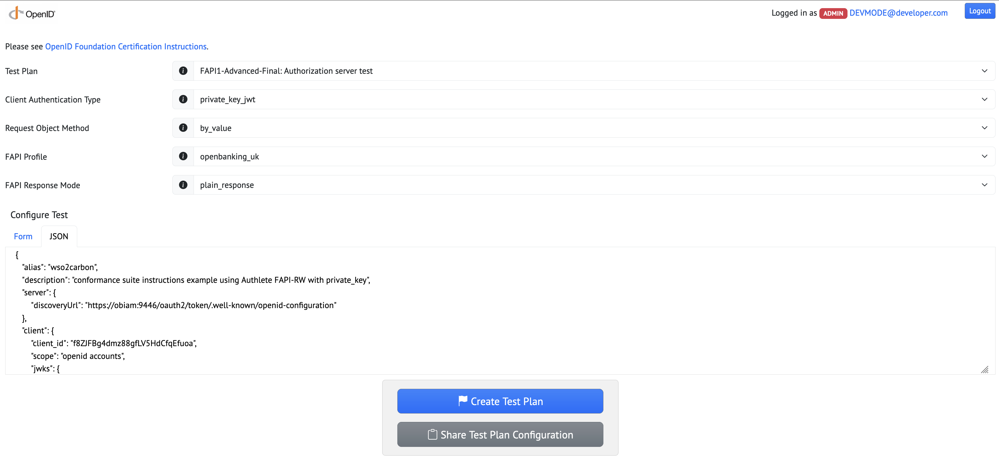
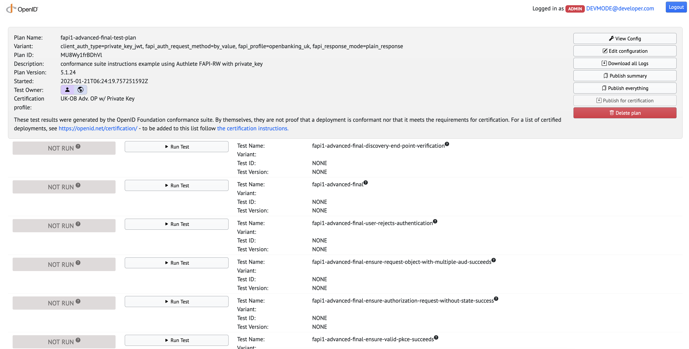

[//]: # (!!!info)

[//]: # (    WSO2 Open Banking 3.0.0 UK Toolkit 1.0.0 supports Security Conformance Suite version 5.1.24.)

The  Open Banking Implementation Entity (OBIE) [Security Conformance](https://openbanking.atlassian.net/wiki/spaces/DZ/pages/1061650703/Security+Profile+Conformance) 
Certificate allows WSO2 Open Banking to demonstrate that the solution has successfully implemented all required security standards that are defined by the Financial Grade API (FAPI) Profile.
It maximises the security of the APIs, providing robust data flow in Open Banking. An advantage of using FAPI security standards is that the Account Servicing Payment Service Provider (ASPSP) can attest the affiliated payment service providers through a self-certification process.

!!! tip "Before you begin:"
    Set up and prepare your servers to run WSO2 Open Banking UK Toolkit. Follow the [Set up Toolkits](../get-started/set-up-toolkits.md) documentation to set up the accelerators and toolkits.

    !!!note
        Makesure to use different hostnames for Identity Server and API Manager except for localhost.

## Generate Locally Signed SSL Certificate

1. Create a new keystore generating a new key-pair. Specifies the server hostnames and IP addresses in Subject Alternative Names (SANs) of the certificate.

    !!!note
        Use the same keystore password (`KEYSTORE_PASSWORD`) that you used to configure the existing keystore.

    ```
    keytool -genkey -alias wso2carbon -keystore wso2carbon.jks -keysize 2048 -keyalg RSA -validity 9999 -dname "CN=<CommonName>, O=OB, L=WSO2, S=COL, C=LK, OU=OB" -ext san=ip:127.0.0.1,dns:localhost,ip:<SERVER_IP>>,dns:<SERVER_HOSTNAME>
    ```

2. Back up the default keystore (`wso2carbon.jks`) residing in the security folder of both WSO2 Identity Server and WSO2 
   API Manager and replace it with the newly created `wso2carbon.jks` file.

3. Repeat the step 1 and step 2 for both the WSO2 Identity Server and WSO2 API Manager.

4. Export the public certificate to a pem file.

    ```
    keytool -export -alias wso2carbon -keystore wso2carbon.jks -file <SERVER_CERT>.pem
    ```

5. Import the generated server certificate to the client truststore of `<WSO2_IS_HOST>` and `<WSO2_APIM_HOST>` servers. 
   The client truststores for the WSO2 Open Banking API Manager and Identity Server are located in the following locations:

     - `<WSO2_IS_HOME>/repository/resources/security/client-truststore.jks`
     - `<WSO2_APIM_HOME>/repository/resources/security/client-truststore.jks`.

    Use the following command to add the certificates to the client truststores:

     ```
     keytool -import -alias mkcert_server_cert -file <SERVER_CERT>.pem -keystore client-truststore.jks -storepass wso2carbon
     ```

    !!!note
         Exchange and trust the API Manager and Identity Server certificates, if the API Manager server and Identity Server are in different nodes.

6. Add the OBIE Root and Issuing Certificates to the `client-truststore.jks`. The client truststores for the WSO2 Open 
    Banking API Manager and Identity Server are located in the following locations:

    - `<WSO2_IS_HOME>/repository/resources/security/client-truststore.jks`
    - `<WSO2_AM_HOME>/repository/resources/security/client-truststore.jks`

    Use the following commands to add the certificates to the client truststores:

    1. Add Root Certificate:
    
        ```
        keytool -import -alias <alias> -file <OB_ROOT_CERT> -keystore client-truststore.jks -storepass wso2carbon
        ```
    
    2. Add Issuing Certificate:
    
        ```
        keytool -import -alias <alias> -file <OB_ISSUING_CERT> -keystore client-truststore.jks -storepass wso2carbon
        ```

## Configure the Well-known Endpoint and Keystore for JWS Validation

### Update the well-known endpoint and JWKS endpoint

Update the well-known endpoint and JWKS endpoint as instructed below according to your setup.

??? tip "Click here to see how it is done:..."

    1. Download and extract the [`well-known-config-resources.zip`](../assets/attachments/well-known-config-resources.zip).

    2. Go to the `well-known-config-resources` directory.

    3. Copy the `auth.server.info-1.0-SNAPSHOT.jar` file to the `<IS_HOME>/repository/components/lib` directory.

    4. Download the sample `openid-configuration.json` available [here](../assets/attachments/openid-configuration.json).

    5. Update the values in `openid-configuration.json` according to your setup.

    6. Replace the `<IS_HOSTNAME>` placeholder with the Identity Server hostname.
    
    7. Copy the `openid-configuration.json` file  into the `<IS_HOME>/repository/conf/identity` directory.

    8. Open the `<IS_HOME>repository/resources/conf/templates/repository/conf/tomcat/web.xml.j2` file and register the following servlets. Add the following elements before the `</webapp>` tag.

        ```xml
        <servlet>
               <servlet-name>Discovery</servlet-name>
               <servlet-class>auth.server.info.Discovery</servlet-class>
           </servlet>
        
           <servlet-mapping>
               <servlet-name>Discovery</servlet-name>
               <url-pattern>/token/.well-known/openid-configuration</url-pattern>
           </servlet-mapping>
        
           <servlet>
               <servlet-name>Keystore</servlet-name>
               <servlet-class>auth.server.info.Keystore</servlet-class>
           </servlet>
        
           <servlet-mapping>
               <servlet-name>Keystore</servlet-name>
               <url-pattern>/token/keystore</url-pattern>
           </servlet-mapping>
        ```

    9. Restart the Identity Server.

    10. Restart the API Manager server.

    11. Go to the following links and see the changes:

        - [https://<IS_HOST>:9446/token/.well-known/openid-configuration](https://<IS_HOST>:9446/token/.well-known/openid-configuration)

## Configure the Solution

1. Open the `<WSO2_IS_HOME>/repository/conf/deployment.toml` file.

2. Set the following configuration to false in the `[open_banking.dcr.registration.callback_uris]` section and comment out the allowed_values field if it is already exist in the deployment.toml.

    ```
    [open_banking.dcr.registration.callback_uris]
    required = false
    ```

## Run the Solution

1. Start the WSO2 Identity Server.

2. Start the WSO2 API Manager Server.

3. Configure the users and roles by following the [Configure Users and Roles](../get-started/configure-users-and-roles.md) documentation.

4. Publish and deploy DCR API and configure key manager by following the [Dynamic Client Registration](../get-started/dynamic-client-registration.md) documentation.

5. Publish and deploy [Account and Transaction API](../try-out/account-and-transaction-flow.md).

6. Create two DCR Applications with distinct signing and transport certificates as each client should have a unique signing and Transport certificates.

   1. Use `https://<DOCKER-BRIDGE_SEVER_HOST/TEST_SUITE_HOST>:8443/test/a/<ALIAS>/callback` as the redirect URL in SSA and DCR request JWT of the first client.
   2. Use `https://<DOCKER-BRIDGE_SEVER_HOST/TEST_SUITE_HOST>:8443/test/a/<ALIAS>/callback?dummy1=lorem&dummy2=ipsum` as the redirect URL in SSA and DCR request JWT of the second client.

       !!!note
   
            The `ALIAS` value must be identical in both URLs, and it can be any value you prefer.
           
            Given below are sample modified redirect URL properties in SSA:
        
           ```json
           "software_client_uri": "https://localhost:8443/test/a/wso2carbon/callback",
           "software_redirect_uris": [
           "https://localhost:8443/test/a/wso2carbon/callback"
           ],
           ```

           Given below are sample modified redirect URL properties in DCR request JWT.  
        
           ```json
           "redirect_uris": [
           "https://localhost:8443/test/a/wso2carbon/callback"
           ],
           
           The ALIAS value is considered as "wso2carbon" in the aboe example.
           ```

       !!! warning
           Configure IS as Key Manager, only after updating keystores.
    
           If you replace the existing keystores after setting up the Key Manager, you will have to delete the newly created key 
           manager entry from DB level (from `openbank_apimgtdb.AM_KEY_MANAGER`) before starting servers again and you’d have to configure it again.

   3. Generate production/sandbox keys for both applications.

## Configure Test Configuration File

1. Download the sample JSON configuration, which is available [here](../assets/attachments/Security_Conformance_TestConfiguration.json).
   2. Modify the configuration file as below.
      1. alias - alias value in the redirect URIs of both applications.
      2. discoveryUrl under server section - url of the openid configuration file hosted in a server. (`https://<WSO2_IS_HOST>:9446/oauth2/token/.well-known/openid-configuration`)

      3. Fill in the client and client2 sections with the following parameters:
         a. client_id - client_id of the first application.
         b. scope - openid accounts
         c. jwks.keys - Client's private signing key in JSON Web Key Set format. (This can be generated online using [PEM to JWK converter tool](https://irrte.ch/jwt-js-decode/pem2jwk.html).)

                !!!note
                Make sure not to include `BEGIN` and `END` tags when  entering the keys to the tool.
      
      4. Fill in the MTLS and MTLS2 sections with the following parameters:
         a. mtls.cert - Content of .pem file of the transport certificate with line breaks replaced with literal \n. 
         b. mtls.key - Content of .key file of the transport certificate with line breaks replaced with literal \n
         c. mtls.ca - Content of OB_SandBox_PP_Root_CA.cer file of the transport certificate with line breaks replaced with literal \n
         [Replace Line Breaks](https://codepen.io/jsnelders/pen/qBByqQy) tool can be used to replace line breaks with literal \n.
      
      5. resourceUrl - AccountsInfoAPI resource URL as shown in the API store. (https://<WSO2_APIM_HOST>:8243/open-banking/v3.1/aisp/)

## Run the Security Conformance Suite

To build and run the system on linux or macOS, follow the steps below:

1. Clone the https://gitlab.com/openid/conformance-suite repository, using the command below.

    ```
    git clone https://gitlab.com/openid/conformance-suite.git
    ```
   
2. Install maven, docker and JAVA 17.
   - Note that for versions of the suite prior to version 3.1, Java/JDK 1.8 should be used.

3. Go to conformance-suite directory and build the conformance suite using the following command.

4. Build the conformance suite using the following command.
    ```
    mvn clean package
    ```
   
5. Open docker-compose.yml file inside the conformance-suite directory and map the localhost and the server hosts with the respective ip under "extra_hosts" property.
    
        !!!note
            Given below is a sample for the above step:
            
            ```
            extra_hosts:
            - "DOCKER-BRIDGE_SEVER_HOST:<docker0 ip>"
            - "localhost:<LOCAL_SERVER_IP"
            - "IS_SERVER_HOSTNAME:<IS_SERVER_IP>"
            - "AM_SERVER_HOSTNAME:<AM_SERVER_IP>"
            ```
6. Comment out the `volumes` property in the docker-compose.yml file only for macOS.

    ```
    mongodb:
    image: mongo:5.0.24
    # volumes:
    #  - ./mongo/data:/data/db
    ```
7. Start the docker container using the following command.

   ```
    docker-compose up
   ```

       !!!note
       Use -f with the above command for the development purpose.

            ```
            docker-compose up -f docker-compose-dev.yml
            docker-compose up -f docker-compose-dev-mac.yml
            ```
   
    For more details, see [Security Conformance Suite Setup Guide](https://gitlab.com/openid/conformance-suite/-/wikis/Developers/Build-&-Run). 

8. The conformance suite is now locally available at <https://localhost:8443>.

    [](../assets/img/conformance/uk-security-conformance-suite.png)

9. Click on **Create a new test plan**.
10. Select an appropriate Open Banking test plan and a client authentication type.

        !!!note
           For the UK Open Banking Security Conformance Suite, select the **FAPI1-Advanced-Final: Authorization server test** test plan.

    [](../assets/img/conformance/uk-conformance-suite-test-plan.png)

11. Select **JSON** tab in `Configure Test` section and paste the content of the [Security_Conformance_TestConfiguration.json](../assets/attachments/Security_Conformance_TestConfiguration.json) file updated during "Configure Test Configuration File" section.

12. Click on *Create Test Plan*.
13. Run each given test in sequence.

    [](../assets/img/conformance/uk-security-conformance-test-scenarios.png)

14. Follow the instructions and the suite will prompt if manual intervention is needed.
    
15. Once the test runs are over, results will be loaded, and you can export the test results by click on the **Download all Logs** button.
