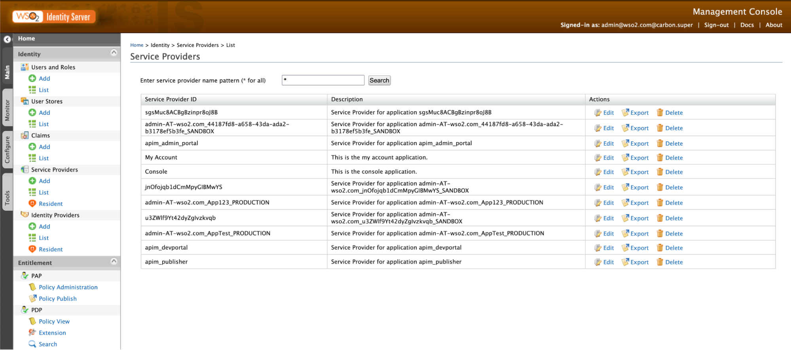
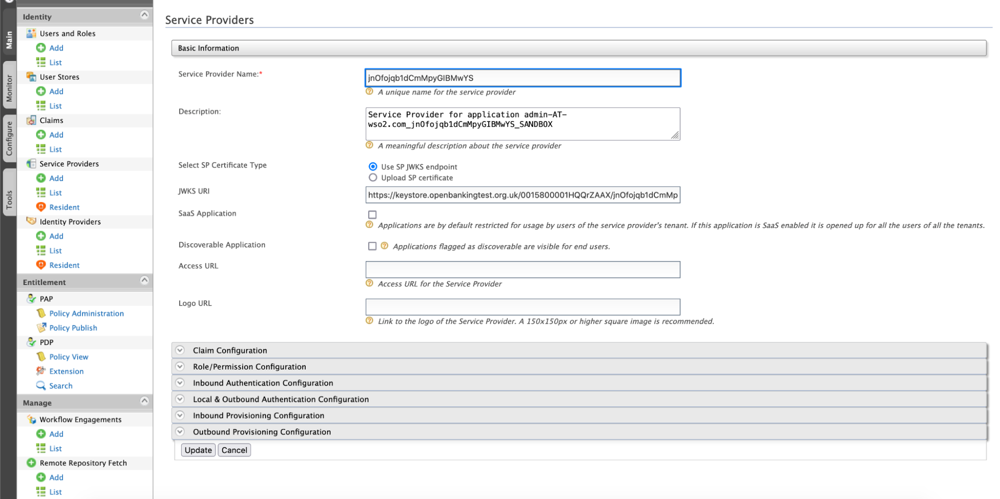
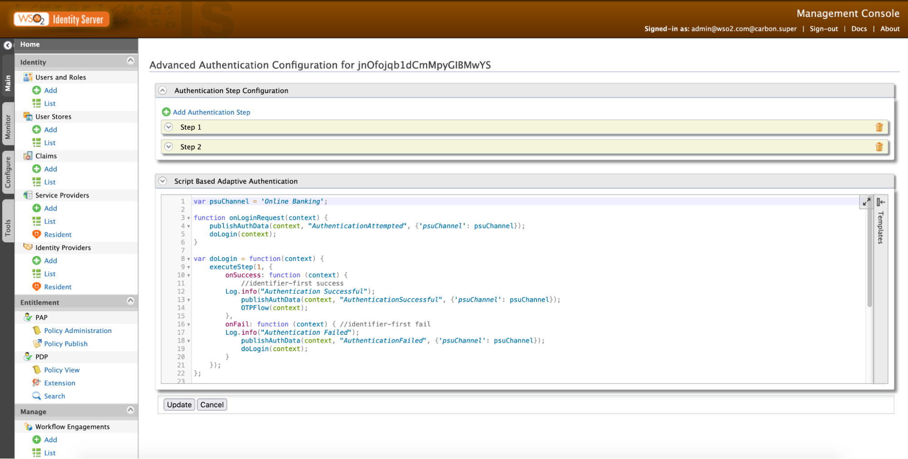

This page explains the modifications that need to be performed after the upgrade/migration process.

## Open Banking Internal Scopes

Configure open banking internal scopes as follows:

1. Open the `<IS_HOME>/repository/conf/deployment.toml` file.

2. Update the allowed scopes according the sample below: 

      ``` toml
      [oauth]
      allowed_scopes = ["consent.*", "OB_.*"]
      ```

## Two-Factor Authentication

If the migrated Service Provider is configured to use two-factor authentication:

1. Update the `<IS_HOME>/repository/conf/common.auth.script.js` file with the following steps:
 
       ``` 
       var psuChannel = 'Online Banking';
        
       function onLoginRequest(context) {
           publishAuthData(context, "AuthenticationAttempted", {'psuChannel': psuChannel});
           doLogin(context);
       }
        
       var doLogin = function(context) {
           executeStep(1, {
               onSuccess: function (context) {
                   //identifier-first success
               Log.info("Authentication Successful");
                   publishAuthData(context, "AuthenticationSuccessful", {'psuChannel': psuChannel});
                   OTPFlow(context);
               },
               onFail: function (context) { //identifier-first fail
               Log.info("Authentication Failed");
                   publishAuthData(context, "AuthenticationFailed", {'psuChannel': psuChannel});
                   doLogin(context);
               }
           });
       };
        
       var OTPFlow = function(context) {
           executeStep(2, {
                    //OTP-authentication
               onSuccess: function (context) {
                   context.selectedAcr = "urn:cds.au:cdr:2";
                   publishAuthData(context, "AuthenticationSuccessful", {'psuChannel': psuChannel});
               },
               onFail: function (context) {
                   publishAuthData(context, "AuthenticationFailed", {'psuChannel': psuChannel});
                   OTPFlow(context);
               }
           });
       };
       ```

2. Update the common auth script of the existing service provider.
     1. Go to the Identity Server Management Console `https://<IS_HOST>:9443/carbon` and log in as the admin user. 
     2. Go to **Service Providers > List**.
     3. Edit the relevant Service Provider. 
     4. Go to **Local & Outbound Authentication Configuration > Advanced Configuration**. 
     5. Replace the existing adaptive authentication script under the **Script Based Adaptive Authentication** section with the following:

        ```
        var psuChannel = 'Online Banking';
        
        function onLoginRequest(context) {
            publishAuthData(context, "AuthenticationAttempted", {'psuChannel': psuChannel});
            doLogin(context);
        }
        
        var doLogin = function(context) {
            executeStep(1, {
                onSuccess: function (context) {
                    //identifier-first success
                Log.info("Authentication Successful");
                    publishAuthData(context, "AuthenticationSuccessful", {'psuChannel': psuChannel});
                    OTPFlow(context);
                },
                onFail: function (context) { //identifier-first fail
                Log.info("Authentication Failed");
                    publishAuthData(context, "AuthenticationFailed", {'psuChannel': psuChannel});
                    doLogin(context);
                }
            });
        };
        
        var OTPFlow = function(context) {
            executeStep(2, {
                     //OTP-authentication
                onSuccess: function (context) {
                    context.selectedAcr = "urn:cds.au:cdr:2";
                    publishAuthData(context, "AuthenticationSuccessful", {'psuChannel': psuChannel});
                },
                onFail: function (context) {
                    publishAuthData(context, "AuthenticationFailed", {'psuChannel': psuChannel});
                    OTPFlow(context);
                }
            });
        };
        ```
        
     6. Click **Update**.