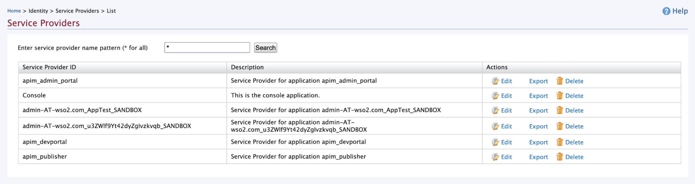

# Troubleshooting Migration Issues

Listed below are the issues identified during the upgrading of the API Manager and Identity Server. 

| Issue | Solution |
|-------|----------|
| `30012 - RoleExistingRole name: admin exists in the system. Please pick another role name.` | Remove the `Internal/admin role` from the Roles List in the Management Console of OB2.0.0 UK setup. |
| `SchemaMigrator Error occurred while executing SQL script for migrating database java.lang.Exception: Error occurred while executing :  INSERT INTO IDN_CONFIG_TYPE (ID, NAME, DESCRIPTION) VALUES ('8ec6dbf1-218a-49bf-bc34-0d2db52d151c', 'CORS_CONFIGURATION', 'A resource type to keep the tenant CORS configurations') SQLServerException: Violation of PRIMARY KEY constraint 'PK__IDN_CONF__3214EC279A760812'. Cannot insert duplicate key in object 'dbo.IDN_CONFIG_TYPE'. The duplicate key value is (8ec6dbf1-218a-49bf-bc34-0d2db52d151c).` | Remove the duplicate row where `NAME=CORS_CONFIGURATION` from the `IDN_CONFIG_TYPE` table. |
| `Error occured while executing  :  CREATE SEQUENCE IDN_CORS_ORIGIN_PK_SEQ. PSQLException: ERROR: relation "idn_cors_origin_pk_seq" already exists.`   This is observed in PSQL | Drop the indices `IDX_IDN_CORS_ASSOCIATION_SP_APP_ID`,  `IDX_IDN_CORS_ASSOCIATION_IDN_CORS_ORIGIN_ID` , drop tables `IDN_CORS_ASSOCIATION`, `IDN_CORS_ORIGIN` and drop the sequence `IDN_CORS_ORIGIN_PK_SEQ` |
| `Error occurred while executing :  CREATE TABLE IDN_REMOTE_FETCH_CONFIG PSQLException: ERROR: relation "idn_remote_fetch_config" already exists` ||
| `Error occurred while executing :   CREATE TABLE IDN_REMOTE_FETCH_REVISIONS PSQLException: ERROR: relation "idn_remote_fetch_revisions" already exists` ||
| `Error occurred while executing :   SELECT skip_index_if_exists('UM_ATTR_NAME_VALUE_INDEX','UM_USER_ATTRIBUTE','(UM_ATTR_NAME, UM_ATTR_VALUE)')PSQLException: ERROR: relation "um_attr_name_value_index" already exists` ||
| `SchemaMigrator Error occurred while executing SQL script for migrating database java.lang.Exception: Error occurred while executing :  UPDATE SP_APP SET APP_NAME = 'My Account', IS_SAAS_APP = 1, DESCRIPTION = 'This is the my account application.' WHERE ID = (SELECT APP_ID FROM SP_INBOUND_AUTH WHERE INBOUND_AUTH_KEY = 'USER_PORTAL' AND TENANT_ID = -1234) SQLServerException: Violation of UNIQUE KEY constraint 'APPLICATION_NAME_CONSTRAINT'. Cannot insert duplicate key in object 'dbo.SP_APP'. The duplicate key value is (My Account, -1234).` | <li> Remove the row where `APP_NAME=My Account` in the `SP_APP` table. </li> <li> Remove the column where `APP_NAME=MYACCOUNT` in the `IDN_OAUTH_CONSUMER_APPS` table. </li> <li> Remove the column where `UM_ROLE_NAME=Application/My Account` in the `UM_HYBRID_ROLE` table. </li> |
| `SchemaMigrator Error occurred while executing SQL script for migrating database java.lang.Exception: Error occurred while executing :  ALTER TABLE UM_TENANT ADD UM_TENANT_UUID VARCHAR(36) NOT NULL DEFAULT LOWER(NEWID()) SQLServerException: Column names in each table must be unique. Column name 'UM_TENANT_UUID' in table 'UM_TENANT' is specified more than once.`   This is observed in MSSQL. | Drop the `DF__UM_TENANT__UM_TE__XXX` and `UQ__UM_TENAN__XXX` constraints from the `UM_TENANT` table.     Also, remove `UM_TENANT_UUID` Column from the `UM_TENANT`table.     If this occurs in PostgreSQL:   Delete the `UM_TENANT_UUID` column from the `UM_TENANT` table and the associated constraint `um_tenant_um_tenant_uuid_key`|
| `SchemaMigrator Error occurred while executing SQL script for migrating database java.lang.Exception: Error occurred while executing :  CREATE INDEX IDX_IDN_CORS_ASSOCIATION_SP_APP_ID ON IDN_CORS_ASSOCIATION (SP_APP_ID) SQLServerException: The operation failed because an index or statistics with name 'IDX_IDN_CORS_ASSOCIATION_SP_APP_ID' already exists on table 'IDN_CORS_ASSOCIATION'.`   This is observed in MSSQL | Drop the `IDX_IDN_CORS_ASSOCIATION_SP_APP_ID` and `IDX_IDN_CORS_ASSOCIATION_IDN_CORS_ORIGIN_ID` constraints from the `IDN_CORS_ASSOCIATION` table. |
| `CREATE OR REPLACE PROCEDURE add_index_if_not_exists (query IN VARCHAR2) IS BEGIN execute immediate query; dbms_output.put_line(query); exception WHEN OTHERS THEN dbms_output.put_line( 'Skipped '); END; , Error Msg = ORA-01031: insufficient privileges (Oracle DB)` | Grant `CREATE PROCEDURE` privileges to users.   For example, `GRANT CREATE PROCEDURE TO <user_name>;` |
| `Error occurred while executing :  ALTER TABLE UM_TENANT ADD UM_TENANT_UUID VARCHAR(36) DEFAULT LOWER(regexp_replace(rawtohex(sys_guid()), '([A-F0-9]{8})([A-F0-9]{4})([A-F0-9]{4})([A-F0-9]{4})([A-F0-9]{12})', '\1-\2-\3-\4-\5')) NOT NULL Caused by: java.sql.SQLException: ORA-01430: column being added already exists in table` | Drop the `UM_TENANT_UUID` column from the `UM_TENANT` table |
| `OAuth2Service Provided Callback URL does not match with the provided one.` | Go to API Publisher and API Developer Portal and update the hostnames in the callback URLs of Service Providers. <ol> <li> Go to the Management Console at <https://APIM_HOST:9443/carbon> </li> <li> Go to **Service Providers > List**   </li> <li> Edit **apim_publisher** </li> <li> Go to **Inbound Authentication Configuration > OAuth/OpenID Connect Configuration > Edit**. </li> <li> Update the hostnames in **Callback Url** with the hostname of your API Manager server </li> </ol> |

