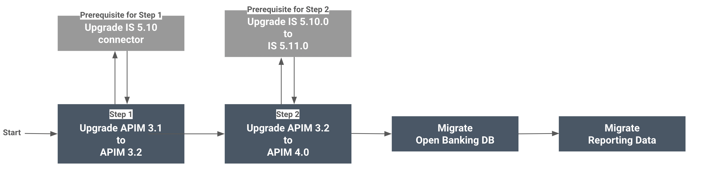

#Upgrading WSO2 Open Banking from 2.0 to 3.0

This section guides on how to upgrade your WSO2 Open Banking 2.0 setup to WSO2 Open Banking 3.0 (Accelerator Model). 

!!! note
    WSO2 Open Banking 2.0 is based on the WSO2 API Manager 3.1.0 and WSO2 Identity Server 5.10.0 products.

The diagram below explains the flow of upgrading the WSO2 Open Banking solution:

  

Follow the topics below in the given order:

  1. [Upgrading to WSO2 API Manager 3.2.0](upgrading-wso2-api-manager-320.md)  
  2. [Upgrading to WSO2 Identity Sever 5.11.0](upgrading-wso2-identity-server.md)  
  3. [Upgrading API Manager 3.2.0 to 4.0.0](upgrading-wso2-api-manager-400.md)  
  4. [Migrating Open Banking Data](open-banking-data-migration.md)  
  5. [Migrating Reporting Data](reporting-data-migration.md)  
  6. [After Migration](modifications-after-migration.md)