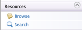
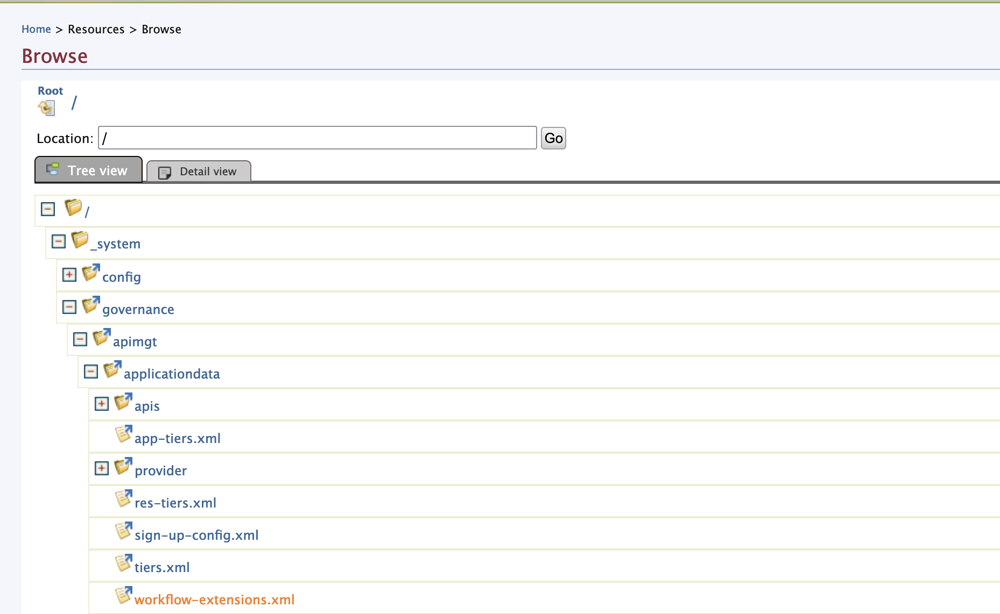
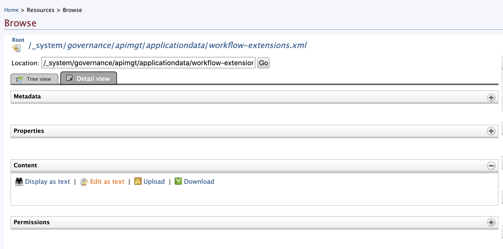
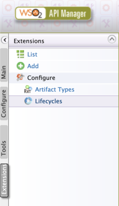
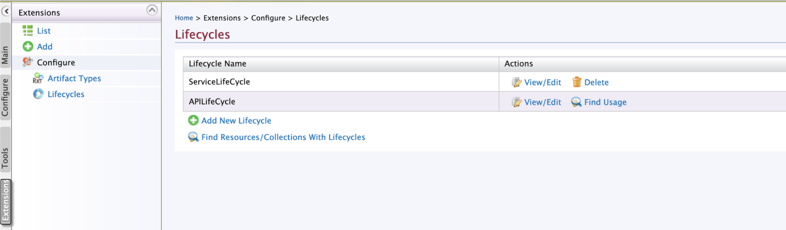
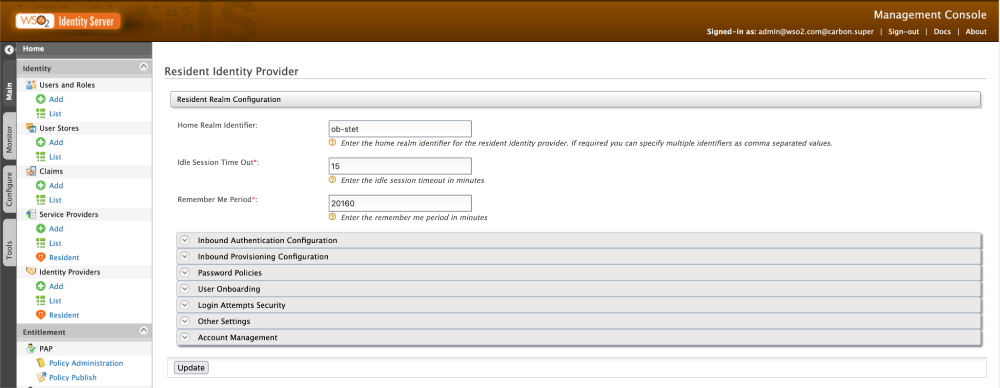
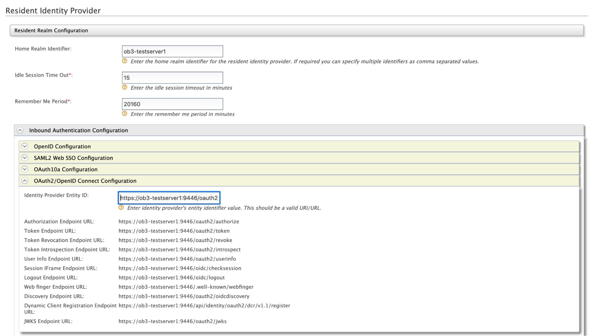

# Upgrading to WSO2 API Manager 4.0.0

!!! tip "Before you begin:"
    Make sure you have upgraded your API Manager to 3.2.0 according to [Upgrading to WSO2 API Manager 3.2.0](upgrading-wso2-api-manager-320.md).

1. Download and install the WSO2 API Manager 4.0.0 distribution from [here](https://wso2.com/api-manager/). 
2. Extract the downloaded archive file. This document refers to the root folder of the extracted file as `<APIM_HOME>`.

## Set up Open Banking Accelerator and UK Toolkit for API Manager

 1. Download the `wso2-obam-accelerator-3.0.0.zip` file and extract it to the `<APIM_HOME>` directory. 
 2. Download the latest updates for `wso2-obam-accelerator-3.0.0`. For more information, see [Getting WSO2 Updates](../setting-up-servers.md#getting-wso2-updates).
 3. Open the `<APIM_HOME>/<APIM_ACCELERATOR_HOME>/repository/conf/configure.properties` file and update the hostnames 
   and database details. These database configurations should point to the databases of Open Banking 2.0.
 4. Go to the `<APIM_HOME>/<APIM_ACCELERATOR_HOME>/bin` directory and run the merge.sh script.

    ```
    ./merge.sh
       ```

 5. Download the `wso2ob-apim-toolkit-uk-1.0.0.zip` file and extract it to the `<APIM_HOME>` directory. 
 6. Download the latest updates for `wso2ob-apim-toolkit-uk-1.0.0`. For more information, see [Getting WSO2 Updates](../setting-up-servers.md#getting-wso2-updates).
 7. Open the `<APIM_HOME>/<APIM_TOOLKIT_HOME>/repository/conf/configure.properties` file and update the hostnames and 
   database details. These database configurations should point to the databases of Open Banking 2.0.
 8. Go to the `<APIM_HOME>/<APIM_TOOLKIT_HOME>/bin` directory and run the merge.sh script.

    ```
    ./merge.sh
    ```
    
 9. Replace the existing `deployment.toml` file in the API Manager as follows:
    - Go to the `<APIM_HOME>/<OB_APIM_TOOLKIT_HOME>/repository/resources` directory.
    - Rename `wso2am-4.0.0-deployment-uk.toml` to `deployment.toml`.
    - Copy the `deployment.toml` file to the `<APIM_HOME>/repository/conf` directory and replace the existing file.

## Upgrading to WSO2 API Manager 4.0.0

1. Before upgrading, start the WSO2 API Manager 4.0.0 server and create a Custom Key Manager by following the 
[Configuring IS as Key Manager](../../try-out/dynamic-client-regsitration-flow.md#configuring-is-as-key-manager) documentation.

2. Once the Identity Server 5.11.0 is configured as the Resident Key Manager, start the Identity Server 5.11.0 before 
starting the API Manager migration.

3. Do not copy any other Key Manager specific configurations from the previous API Manager version to the latest 
one that points to the Identity Server.

4. Upgrade your API Manager from 3.2.0 to 4.0.0 by following the [API Manager documentation](https://apim.docs.wso2.com/en/latest/install-and-setup/upgrading-wso2-api-manager/upgrading-from-320-to-400/).

    !!! note
        When following the [API Manager documentation](https://apim.docs.wso2.com/en/latest/install-and-setup/upgrading-wso2-api-manager/upgrading-from-320-to-400/):
    
         1. You can skip the steps 1,2, and 3 under [Step 1 - Migrate the API Manager configurations](https://apim.docs.wso2.com/en/latest/install-and-setup/upgrading-wso2-api-manager/upgrading-from-320-to-400/#step-1-migrate-the-api-manager-configurations).
       
         2. Modify the following configurations in the `<APIM_HOME>/repository/conf/deployment.toml` file before starting the migration.
    
           ``` toml
           [[apim.gateway.environment]]
           name = "Production and Sandbox"
           [apim.sync_runtime_artifacts.gateway]
           gateway_labels =["Production and Sandbox", "Default"]
           ```
       
         3. In [Step 2 - Upgrade API Manager to 4.0.0](https://apim.docs.wso2.com/en/latest/install-and-setup/upgrading-wso2-api-manager/upgrading-from-320-to-400/#step-2-upgrade-api-manager-to-400),
            skip the steps 3 and 5.

6. Start the API Manager server.

### Replace Custom Mediation Policies

This section explains how to replace the Custom Mediation Policy of each API with the latest Mediation Policy.

1. Go to the API Publisher at `https://<APIM_HOST>:9443/publisher`.
2. Select the respective API.
3. Go to **API Configurations > Runtime**.
4. Click the **Edit** button under **Request > Message Mediation** and remove the existing Custom Mediation Policy.
5. Upload the relevant insequence file from the `<APIM_HOME>/<OB_APIM_TOOLKIT_HOME>/repository/resources/apis` directory 
and click **Select**.
6. Scroll down and click **SAVE**.
7. Go to **Deployments** using the left menu pane.
8. Click **Deploy New Version**.
9. Select the **API Gateway type** and **Deploy**.
10. Repeat these steps for all APIs. 

### Enable Schema Validation

This section explains how to enable Schema Validation for APIs.

1. Go to the API Publisher at `https://<APIM_HOST>:9443/publisher`.
2. Select the respective API.
3. Go to **API Configurations > Runtime**.
4. Enable Schema Validation.
5. Scroll down and click **SAVE**.
6. Go to **Deployments** using the left menu pane.
7. Click **Deploy New Version**.
8. Select the **API Gateway type** and **Deploy**.
10. Repeat these steps for all APIs except for the Dynamic Client Registration(DCR) API. 

### Update Workflow-Extensions

1. Go to the Management Console `https://<APIM_HOST>:9443/carbon` and log in as the admin user. 
2. Select **Resources > Browse** in the left pane. <br/> 
3. Locate the `/_system/governance/apimgt/applicationdata/workflow-extensions.xml` file. 
4. Click **Edit as text** and replace the content with the content <a href="../../../assets/attachments/workflow.txt" download> here</a>. 

### Update API Life Cycle

1. Go to the Management Console `https://<APIM_HOST>:9443/carbon` and log in as the admin user. 
2. Select **Extensions > Lifecycles**. <br/> 
3. Click the **View/Edit** button for APILifeCycle. 
4. Replace the Lifecycle Source with the content <a href="../../../assets/attachments/lifecycle.txt" download> here</a>.

###  Update Identity Provider Entity ID 

1. Go to Identity Server Management Console `https://<IS_HOST>:9446/carbon` and log in as the admin user.
2. Select **Identity Providers > Resident**. 
3. Go to **Inbound Authentication Configuration > OAuth2/OpenID Connect Configuration**.
4. Update the **Identity Provider Entity ID** to the following: 
    ```
    https://<IS_HOST>:9446/oauth2/token
    ```
   
     

5. Click **Update**.
