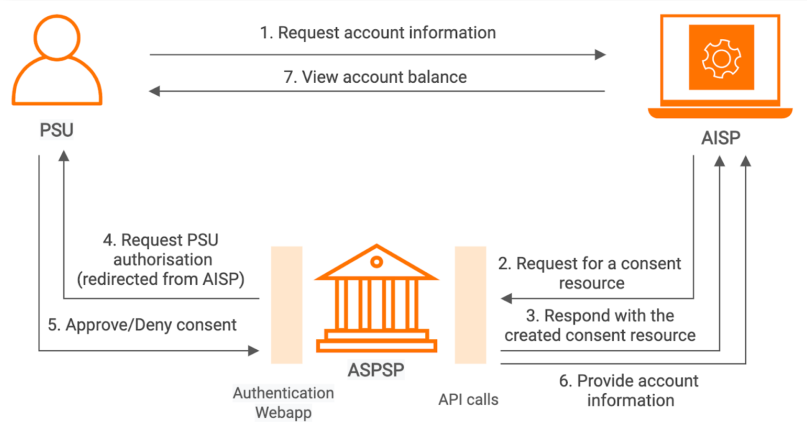

!!!info
    Some content in this documentation is subject to the [MIT Open Licence](https://www.openbanking.org.uk/open-licence/). 
    For further information, see [Copyright and Licence](copyright-and-licence.md).

## Introduction

This page explains the flow of the [Account Information and Transaction API by OBIE](https://openbankinguk.github.io/read-write-api-site3/v3.1.10/profiles/account-and-transaction-api-profile.html). 
The Account Information Service Provider (AISP) can use the API endpoints described here to do the following:

- Register a resource to retrieve account information by creating an account access consent. This registers data that the customer 
  (PSU) has consented to provide to the AISP such as data permissions, expiration, and historical period allowed for transactions/statements.
- Subsequently, retrieve account and transaction data.

## Basic flow

See the below diagram describing the basic accounts information flow:

The PSU requests to access account information data using an AISP solution (A third-party provider). The AISP connects to 
the ASPSP that services the PSU's accounts and creates an `account-access-consent` resource. This informs the ASPSP that one 
of its PSUs is granting access to account and transaction information to an AISP. In this case, the AISP makes a `POST` request 
to ASPSP's `/account-access-consents` endpoint. The ASPSP responds with an identifier for the resource (the `ConsentId`). 
The `account-access-consent` resource will include the following fields which describe the data that the PSU has consented with the AISP:

- Permissions - a list of data clusters that have been consented for access
- Expiration Date - an optional expiration for when the AISP will no longer have access to the PSU's data
- Transaction Validity Period - the From/To date range which specifies a historical period for transactions and statements which may be accessed by the AISP

The AISP acts as a mediator for data to other parties, so it is valid for a PSU to have multiple `account-access-consents` 
for the same accounts, with different consent/authorisation parameters agreed. The AISP requests the PSU to authorise the consent. 
The ASPSP uses the redirection flow for this.

1. In a redirection flow, the AISP redirects the PSU to the ASPSP
2. The redirect includes `ConsentId` generated in the previous step
3. This allows the ASPSP to correlate the `account-access-consent` that was setup
4. The ASPSP authenticates the PSU
5. The ASPSP updates the state of the `account-access-consent` resource internally to indicate that the account access consent has been authorised
6. Once the consent has been authorised, the PSU is redirected back to the AISP

Once the PSU authorises the consent for the TPP to access account information, the AISP makes an API call to the ASPSP 
to retrieve account information. When the ASPSP provides account information, the TPP can expose the information via the 
AISP solution. 

For more information, see [Account and Transaction API Flow](../try-out/account-and-transaction-flow.md).

## Endpoints

To access account information and transaction data, you can use the following available API endpoints:

<table>
<thead>
  <tr>
    <th>Endpoint Name</th>
    <th>Supported Version</th>
    <th>Resource</th>
    <th>Endpoint URL</th>
    <th>Mandatory/Optional</th>
  </tr>
</thead>
<tbody>
  <tr>
    <td rowspan="3">Account Access Consents</td>
    <td rowspan="3">v3.1.5 v3.1.6 v3.1.8 v3.1.9 v3.1.10 v3.1.11</td>
    <td rowspan="3"><code>account-access-consents</code></td>
    <td><code>POST /account-access-consents</code></td>
    <td>Mandatory</td>
  </tr>
  <tr>
    <td><code>GET /account-access-consents/{ConsentId}</code></td>
    <td>Mandatory</td>
  </tr>
  <tr>
    <td><code>DELETE /account-access-consents/{ConsentId}</code></td>
    <td>Mandatory</td>
  </tr>
  <tr>
    <td rowspan="2">Accounts</td>
    <td rowspan="2">v3.1.5 v3.1.6 v3.1.8 v3.1.9 v3.1.10 v3.1.11</td>
    <td rowspan="2"><code>accounts</code></td>
    <td><code>GET /accounts</code></td>
    <td>Mandatory</td>
  </tr>
  <tr>
    <td><code>GET /accounts/{AccountId}</code></td>
    <td>Mandatory</td>
  </tr>
  <tr>
    <td rowspan="2">Balances</td>
    <td rowspan="2">v3.1.5 v3.1.6 v3.1.8 v3.1.9 v3.1.10 v3.1.11</td>
    <td rowspan="2"><code>balances</code></td>
    <td><code>GET /accounts/{AccountId}/balances</code></td>
    <td>Mandatory</td>
  </tr>
  <tr>
    <td><code>GET /balances</code></td>
    <td>Optional</td>
  </tr>
  <tr>
    <td rowspan="2">Transactions</td>
    <td rowspan="2">v3.1.5 v3.1.6 v3.1.8 v3.1.9 v3.1.10 v3.1.11</td>
    <td rowspan="2"><code>transactions</code></td>
    <td><code>GET /accounts/{AccountId}/transactions</code></td>
    <td>Mandatory</td>
  </tr>
  <tr>
    <td><code>GET /transactions</code></td>
    <td>Optional</td>
  </tr>
  <tr>
    <td rowspan="2">Beneficiaries</td>
    <td rowspan="2">v3.1.5 v3.1.6 v3.1.8 v3.1.9 v3.1.10 v3.1.11</td>
    <td rowspan="2"><code>beneficiaries</code></td>
    <td><code>GET /accounts/{AccountId}/beneficiaries</code></td>
    <td>Conditional</td>
  </tr>
  <tr>
    <td><code>GET /beneficiaries</code></td>
    <td>Optional</td>
  </tr>
  <tr>
    <td rowspan="2">Direct Debits</td>
    <td rowspan="2">v3.1.5 v3.1.6 v3.1.8 v3.1.9 v3.1.10 v3.1.11</td>
    <td rowspan="2"><code>direct-debits</code></td>
    <td><code>GET /accounts/{AccountId}/direct-debits</code></td>
    <td>Conditional</td>
  </tr>
  <tr>
    <td><code>GET /direct-debits</code></td>
    <td>Optional</td>
  </tr>
  <tr>
    <td rowspan="2">Standing Orders</td>
    <td rowspan="2">v3.1.5 v3.1.6 v3.1.8 v3.1.9 v3.1.10 v3.1.11</td>
    <td rowspan="2"><code>standing-orders</code></td>
    <td><code>GET /accounts/{AccountId}/standing-orders</code></td>
    <td>Conditional</td>
  </tr>
  <tr>
    <td><code>GET /standing-orders</code></td>
    <td>Optional</td>
  </tr>
  <tr>
    <td rowspan="2">Products</td>
    <td rowspan="2">v3.1.5 v3.1.6 v3.1.8 v3.1.9 v3.1.10 v3.1.11</td>
    <td rowspan="2"><code>products</code></td>
    <td><code>GET /accounts/{AccountId}/product</code></td>
    <td>Conditional</td>
  </tr>
  <tr>
    <td><code>GET /products</code></td>
    <td>Optional</td>
  </tr>
  <tr>
    <td rowspan="2">Offers</td>
    <td rowspan="2">v3.1.5 v3.1.6 v3.1.8 v3.1.9 v3.1.10 v3.1.11</td>
    <td rowspan="2"><code>offers</code></td>
    <td><code>GET /accounts/{AccountId}/offers</code></td>
    <td>Conditional</td>
  </tr>
  <tr>
    <td><code>GET /offers</code></td>
    <td>Optional</td>
  </tr>
  <tr>
    <td rowspan="3">Party</td>
    <td rowspan="3">v3.1.5 v3.1.6 v3.1.8 v3.1.9 v3.1.10 v3.1.11</td>
    <td rowspan="3"><code>party</code></td>
    <td><code>GET /accounts/{AccountId}/parties </code></td>
    <td>Conditional</td>
  </tr>
  <tr>
    <td><code>GET /accounts/{AccountId}/party</code></td>
    <td>Conditional</td>
  </tr>
  <tr>
    <td><code>GET /party</code></td>
    <td>Conditional</td>
  </tr>
  <tr>
    <td rowspan="3">Parties</td>
    <td rowspan="3">v3.1.5 v3.1.6 v3.1.8 v3.1.9 v3.1.10 v3.1.11</td>
    <td rowspan="3"><code>parties</code></td>
    <td><code>GET /accounts/{AccountId}/parties</code></td>
    <td>Conditional</td>
  </tr>
  <tr>
    <td><code>GET /accounts/{AccountId}/party</code></td>
    <td>Conditional</td>
  </tr>
  <tr>
    <td><code>GET /party</code></td>
    <td>Conditional</td>
  </tr>
  <tr>
    <td rowspan="2">Scheduled Payments</td>
    <td rowspan="2">v3.1.5 v3.1.6 v3.1.8 v3.1.9 v3.1.10 v3.1.11</td>
    <td rowspan="2"><code>scheduled-payments</code></td>
    <td><code>GET /accounts/{AccountId}/scheduled-payments </code></td>
    <td>Conditional</td>
  </tr>
  <tr>
    <td><code>GET /scheduled-payments</code></td>
    <td>Optional</td>
  </tr>
  <tr>
    <td rowspan="5">Statements</td>
    <td rowspan="5">v3.1.5 v3.1.6 v3.1.8 v3.1.9 v3.1.10 v3.1.11</td>
    <td rowspan="5"><code>statements</code></td>
    <td><code>GET /accounts/{AccountId}/statements</code></td>
    <td>Conditional</td>
  </tr>
  <tr>
    <td><code>GET /accounts/{AccountId}/statements/{StatementId}</code></td>
    <td>Conditional</td>
  </tr>
  <tr>
    <td><code>GET /accounts/{AccountId}/statements/{StatementId}/file</code></td>
    <td>Optional</td>
  </tr>
  <tr>
    <td><code>GET /accounts/{AccountId}/statements/{StatementId}/transactions</code></td>
    <td>Conditional</td>
  </tr>
  <tr>
    <td><code>GET /statements</code></td>
    <td>Optional</td>
  </tr>
</tbody>
</table>