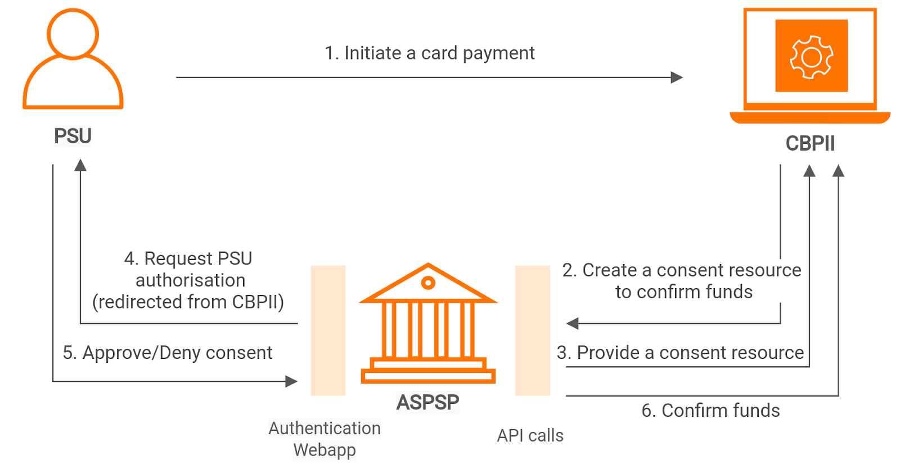

## Introduction

This page explains the flow of the [Confirmation of Funds API by OBIE](https://openbankinguk.github.io/read-write-api-site3/v3.1.10/profiles/confirmation-of-funds-api-profile.html) 
in WSO2 Open Banking. The Confirmation of Funds API allows users to create a funds confirmation consent request, and manage the funds confirmation consents by 
checking and revoking the status. The Card-Based Payment Instrument Issuer (CBPII) must request to create the resource 
to create a funds confirmation consent request.

Endpoints for the API allows the Card-Based Payment Instrument Issuer (CBPII) to:

- Request fund confirmation by creating a `funds-confirmation-consent` resource with an Account Servicing Payment Service 
Provider (ASPSP). There must be an agreement between the Customer (PSU) and ASPSP. It consists of an expiration date 
for the funds consent granted by the PSU to the CBPII.
- Confirm the funds that are available from time to time. Funds can only be confirmed against the currency of the account.

## Basic flow

The diagram below shows the request flow of the Confirmation of Funds API. It is assumed that the CBPII has issued a PSU 
a card and that the PSU would like to use the card adhering to PSD2. 

1. The PSU initiates a card payment. 
2. The CBPII requests to create a `funds-confirmation-consent` resource by connecting to the ASPSP that supports the PSU's funds.
3. The `ConsentId` (Consent identifier) is generated by the ASPSP to respond to the resource.
4. The CBPII requests the PSU to provide consent. 
5. The ASPSP carries out the agreement of consent in a decoupled or a redirect flow. 

    Currently, WSO2 Open Banking supports the redirect flow. Thereby, the CBPII redirects the PSU to the ASPSP. 
    In the redirect flow:

    1. The ASPSP can co-relate the `funds-confirmation-consent` resource created by the CBPII using the `ConsentID` generated in step 3.
    2. The ASPSP authenticates the PSU. 
    3. The PSU grants explicit consent to the ASPSP to respond to the confirmation of funds request. 
    4. The ASPSP updates the `funds-confirmation-consent` resource internally to authorise the resource. 
    5. Once the consent is authorised, the PSU is redirected back to the CBPII.

6. A card payment is directly or indirectly initiated by the PSU.

The CBPII then requests to create a `funds-confirmation` resource by connecting to the ASPSP where the PSU's account is supported. 

- This indicates to the ASPSP that the PSU would confirm that the payments are available for the specific payment account.
- The ASPSP responds with a boolean (`YES`/`NO`) to the `funds-confirmation-consent` resource.
- The step is carried out in a `POST` request to the `funds-confirmation` endpoint with an authorisation code grant.
- The payload will include these fields, which describe the data that the PSU has consented with the CBPII:
     - `Amount` - The amount to be confirmed available.
     - `ConsentId` - An ID that relates the request to a `funds-confirmation-consent`, and specific account with the ASPSP. This ID must match the intent identifier.
- Finally, the CBPII checks the status of `funds-confirmation-consent` resource with the `consentId`. This step is carried 
  out by a `GET` request to the `funds-confirmation-consents` endpoint with the client credentials grant.

For more information, see [Confirmation of Funds API Flow](../try-out/confirmation-of-funds-flow.md).

## Endpoints

Once you deploy the Confirmation of Funds API, you can access consent and funds confirmation information via the following API endpoints:

<table>
<thead>
  <tr>
    <th>Endpoint Name</th>
    <th>Supported Version</th>
    <th>Resource</th>
    <th>Endpoint URL</th>
    <th>Mandatory/Optional</th>
  </tr>
</thead>
<tbody>
  <tr>
    <td rowspan="3">Funds Confirmation Consent</td>
    <td rowspan="3">v3.1.5 v3.1.6 v3.1.8 v3.1.9 v3.1.10</td>
    <td rowspan="3"><code>funds-confirmation-consent</code></td>
    <td><code>POST /funds-confirmation-consents</code></td>
    <td>Mandatory</td>
  </tr>
  <tr>
    <td><code>GET /funds-confirmation-consents/{ConsentId}</code></td>
    <td>Mandatory</td>
  </tr>
  <tr>
    <td><code>DELETE /funds-confirmation-consents/{ConsentId}</code></td>
    <td>Mandatory</td>
  </tr>
  <tr>
    <td>Funds Confirmation</td>
    <td>v3.1.5 v3.1.6 v3.1.8 v3.1.9 v3.1.10</td>
    <td><code>funds-confirmation</code></td>
    <td><code>POST /funds-confirmations</code></td>
    <td>Mandatory</td>
  </tr>
</tbody>
</table>

